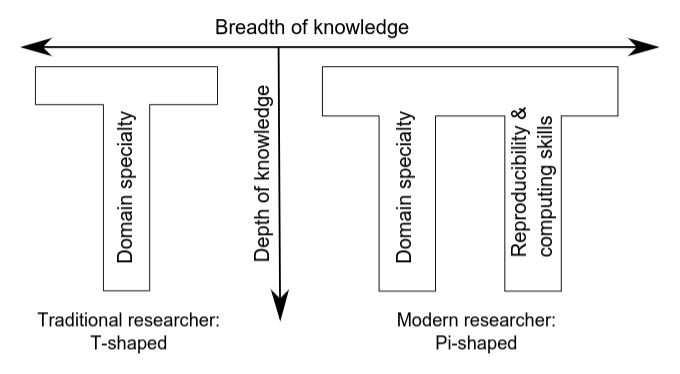
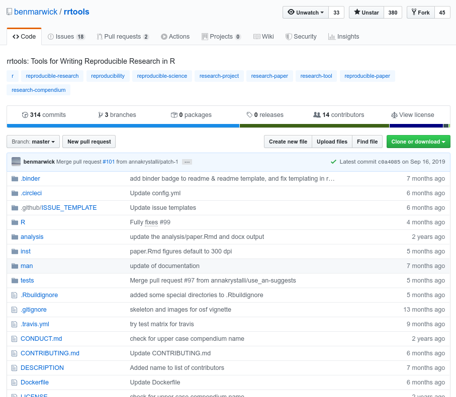
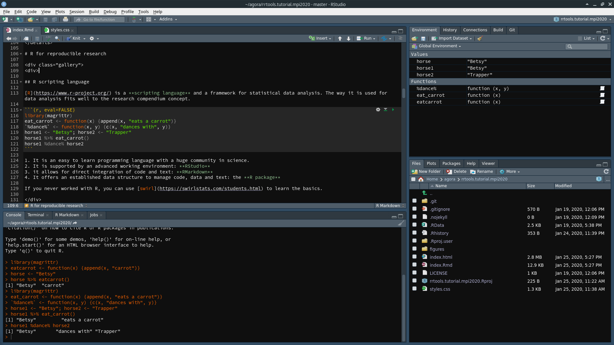

```{r setup, include=FALSE}
knitr::opts_chunk$set(eval = FALSE)

astro <- function() {
  fontawesome::fa("user-astronaut", fill = "#c7254e")
}
rocket <- function() {
  fontawesome::fa("rocket", fill = "#c7254e")
}
```

[**https://nevrome.github.io/rrtools.tutorial.mpi2020**](https://nevrome.github.io/rrtools.tutorial.mpi2020)  
Github: https://github.com/nevrome/rrtools.tutorial.mpi2020


This tutorial was compiled by [Clemens Schmid](https://nevrome.de/) for a [workshop on reproducible research and data management at MPI-SHH](https://rrdm-shh.github.io) in January 2020. It's based on and inspired by two workshops prepared by [Ben Marwick](http://faculty.washington.edu/bmarwick/) for the [SAA2019 conference](https://benmarwick.github.io/2019-04-10-saa/) and [Brown University Digital Archaeology Lab](https://benmarwick.github.io/2019-12-09-brown/).

# The research compendium

<div class="gallery">
<div>

## Idea

> A research compendium is a manuscript accompanied by code and data files (or persistent links to reputable online repositories) that allows reviewers and readers to reproduce and extend the results without needing any further materials from the original authors [...].
> 
> -- Marwick 2017, 442.

A research compendium contains **relevant information** to make the **scientific process** behind a book, book chapter or journal article **more transparent** and **reproducible**.

Ideally it contains **all** **data**, **code** and **text** necessary to compile the published document. 

This might be **difficult sometimes** due to raw data size, publishing **restrictions** or parts of the workflow that are **not quantitative** or inherently impossible to reproduce.

The term research compendium therefore covers a whole **range of imaginable degrees of completeness**.

</div>
<div>

## Data

Research can only be **reproduced**, **checked** and **expanded** when underlying raw data is available.

Data sharing is a **moral obligation** and **non-trivial**. 

Marwick & Birch 2018 have some recommendations:

- Anticipate how your data will be used
- Keep raw data **raw**
- Store data in **open formats**
- Data should be structured for analysis (**tidy data**)
- Data should be uniquely identifiable (**persistent references**)
- Provide relevant **metadata**
- Adopt the proper **privacy** protocols
- Use a trustworthy **repository**
- Use an open **license**

</div>
<div>

## Code

In most contexts of **quantitative research** data analysis can be expressed in the form of a **computer script**. Other researchers should be able to run our script to **obtain the same statistical results and data visualizations**. 

**Computational reproducibility** is an important foundation of scientific progress, that requires a **new type of researcher**:



</div>
<div>

## Text

Text can be integrated with data and code to be more **interlinked**, **transparent** and **didactically powerful**: 

This can preciscly answer questions like **"106 samples? Where is this number coming from?"**. Hopefully not `round(runif(1) * 200)`, but solid algorithms like `number_of_samples_with_raikenburg_treatment()`.

In the future **interactive documents** may become more popular: e.g. Shiny Documents (https://github.com/nevrome/neiman1995)

</div>
<div>

## What we will do today

Research compendia can be compiled in many different ways. 

I will present **one particular workflow** based on our R package [rrtools](https://github.com/benmarwick/rrtools). 



</div>
</div>

The following figure by [Marwick 2017](https://www.practicereproducibleresearch.org/case-studies/benmarwick.html) illustrates one implementation of this workflow.

<details>

</details>

# R for reproducible research

<div class="gallery">
<div>

## R scripting language

[R](https://www.r-project.org/) is a **scripting language** and a framework for statistical data analysis. The way it is used for data analysis fits well to the research compendium concept. 

```{r, eval=FALSE}
library(magrittr)
eat_carrot <- function(x) {append(x, "eats a carrot")}
`%dance%` <- function(x, y) {c(x, "dances with", y)}
horse1 <- "Betsy"; horse2 <- "Trapper"
horse1 %>% eat_carrot()
horse1 %dance% horse2
```

1. It is an easy to learn programming language with a huge community in science.
2. It is supported by an advanced working environment: **RStudio** 
3. It allows for direct integration of code and text: **RMarkdown**
4. It offers an established data structure to manage code, data and text: the **R package**

If you never worked with R, you can use [swirl](https://swirlstats.com/students.html) to learn the basics.

</div>
<div>

## RStudio

[RStudio](https://rstudio.com/products/rstudio/) is an **integrated development environment** (IDE) for R. 



</div>
<div>

## RStudio

`r astro()``r rocket()`
Open RStudio.

`r astro()``r rocket()`
Inspect the RStudio interface.

`r astro()``r rocket()`
Open an R code file, add some code (`1 + 1`), select it and run it in the R console with <kbd>ctrl</kbd> + <kbd>enter</kbd>.

</div>
<div>

## R Markdown

[Markdown](https://daringfireball.net/projects/markdown/) is a lightweight and easy-to-use **markup language** for styling your writing. 

```
# Header 1
## Header 2

- Bulleted
- List

**Bold** and _Italic_ and `Code` text or [Link](url) and 
```

[Here](https://github.com/adam-p/markdown-here/wiki/Markdown-Cheatsheet)'s a cheatsheet that documents all basic Markdown features.

Text written in Markdown can **easily converted** to more advanced layout systems like **HTML** or **LaTex** or **MS Word**. This website is written in Markdown.

[RMarkdown](https://rmarkdown.rstudio.com/) is an advanced implementation of Markdown that allows to **combine text and code**. It adds the possibility to define chunks of code that run when the document is rendered.

</div>
<div>

## R Markdown

`r astro()``r rocket()`
Open an Rmarkdown file based on the default RStudio template, inspect it and render it with the <kbd>Knit</kbd> button.

</div>
<div>

## R Packages

R packages are a core feature of R. They contain **ready to use functions, documentation and example data** in a **standard structure**.

There currently are **>15000 R packages** mostly written and maintained by **volunteers** for all sorts of research questions and applications. 

```
mypackage/
|
├── DESCRIPTION         # Package metadata
├── R/                  # R code
├── man/                # Function documentation
├── NAMESPACE/          # Exported names
├── vignettes/          # Extended documentation
├── data/               # (Example) data
├── tests/              # Unit tests
├── src/                # Compiled language code
└── inst/               # Arbitrary, additional files
```

An example: https://github.com/nevrome/bleiglas

[Here](http://r-pkgs.had.co.nz/)'s an excellent introduction if you want to create an own package.

</div>
</div>

# rrtools setup

<div class="gallery">
<div>

## rrtools

[rrtools](https://github.com/benmarwick/rrtools) is a **mighty wizard** package written by Ben Marwick and colleagues that facilitates some of the steps of research compendium creation and maintenance. It has a **lot of dependencies** and it is **strongly opinionated**.


</div>
<div>

## Create an R package

If rrtools is installed on your system you can start immediately to use it in R.

`r astro()``r rocket()` 
Run `rrtools::use_compendium("~/test/mycompendium")` to create a basic R package with the name `project`.

`r astro()``r rocket()` 
Inspect both the command output in the old and the new RStudio session.

`r astro()``r rocket()` 
Inspect the compendium file structure.

`r astro()``r rocket()` 
Edit the `DESCRIPTION` file (located in your `project` directory) to include some better metadata.

For the future keep in mind to periodically update the `Imports:` section of the `DESCRIPTION` file with the names of packages used in the code we write in `/R` and the Rmd document(s).

</div>
<div>

## Activate version control

`r astro()``r rocket()` 
<strike>Run `usethis::use_git_config(user.name = "", user.email = "")` to configure git.</strike>

`r astro()``r rocket()` 
Run `usethis::use_git()` to initiate git for this project (`git init`). Follow the command line instruction of this function. 

`r astro()``r rocket()` 
Inspect the new <kbd>Git</kbd> tab in the top right RStudio panel.

`r astro()``r rocket()` 
Run `usethis::browse_github_pat()` to get to the right page to create a github access token. This access token is needed to control Github remotely. When you generate the token (click “Generate new token”), make sure the “repo” scope is included by checking the “repo” box. Don’t save this token in your project, keep it elsewhere.

`r astro()``r rocket()` 
Run `usethis::use_github(protocol = "ssh", auth_token = "your token")` to create a repository for your local project on Github.

`r astro()``r rocket()`
Test your Git + Github setup by editing the DESCRIPTION file ones more and by pushing the result.

</div>
<div>

## Establish the compendium file structure

`r astro()``r rocket()` 
Run `rrtools::use_analysis()` to create the basic files and directory structure and transform this R package into a research compendium.

`r astro()``r rocket()` 
Inspect the command line output of this function and the resulting file structure.

```
analysis/
|
├── paper/
│   ├── paper.Rmd       # this is the main document to edit
│   └── references.bib  # this contains the reference list information
│
├── figures/            # location of the figures produced by the Rmd
|
├── data/
│   ├── raw_data/       # data obtained from elsewhere
│   └── derived_data/   # data generated during the analysis
|
└── templates
    ├── journal-of-archaeological-science.csl
    |                   # this sets the style of citations & reference list
    ├── template.docx   # used to style the output of the paper.Rmd
    └── template.Rmd
```

`r astro()``r rocket()` 
Commit and push the setup.

</div>
<div>

## Inspect the manuscript

`r astro()``r rocket()`
Inspect the `./analysis/paper/paper.Rmd` file.

`r astro()``r rocket()`
Render it with the <kbd>Knit</kbd> button and inspect the resulting `.docx` file.

</div>
</div>

# rrtools workflow

<div class="gallery">
<div>

## Collect some data

`r astro()``r rocket()`
Create a file `names.txt` in `./analysis/data/raw_data` that contains the first names of some of the people around you.

```
Paul
Hannah
Anne
Maxime
Clemens
```

</div>
<div>

## Add an R function to analyse and plot this data

`r astro()``r rocket()`
Create a file `plot_name_dist_matrix.R` in `./R` to define an R function.

```{r}
#' Calculate Levenshtein distance between strings in the input vector
#'
#' @param x A character vector
#'
#' @return Nothing. Only called for the plot
#' @export
plot_name_dist_matrix <- function(x) {
  # calculate distances
  dist_matrix <- as.matrix(stringdist::stringdistmatrix(x, method = "lv"))
  # plot
  image(dist_matrix, axes = FALSE)
  axis(1, at = seq(0, 1, length = length(x)), labels = x)
  axis(2, at = seq(0, 1, length = length(x)), labels = x)
  text(
    expand.grid(seq(0, 1, length = length(x)), seq(0, 1, length = length(x))),
    labels = dist_matrix
  )
}
```

</div>
<div>

## Make this function available in the manuscript file

`r astro()``r rocket()`

### The lazy way

Add a call to a function at the beginning of the `paper.Rmd` file that simply loads every function in the package:

```{r}
devtools::load_all()
```

### The knigths of R way

Build the package documentation (<kbd>CTRL</kbd>+<kbd>Shift</kbd>+<kbd>D</kbd>) and install the package (<kbd>CTRL</kbd>+<kbd>Shift</kbd>+<kbd>B</kbd>).

</div>
<div>

## Incorporate data and code into the manuscript

`r astro()``r rocket()`
Edit `./analysis/paper/paper.Rmd` to include our analysis in an R code chunk with the chunk options `{r, fig.width = 10, fig.height=10}`.

```{r}
names_vector <- readLines(here::here("analysis/data/raw_data/names.txt"))

mycompendium::plot_name_dist_matrix(names_vector)
```

`r astro()``r rocket()`
Render `paper.Rmd` again to see the result.

</div>
</div>

# rrtools advanced

<div class="gallery">
<div>

## README, Code of Conduct and Contribution

Beyond the bare code an established open source software project in the 21st century should have at least the following three things:

- A `README.md` file that gives a minimal description what this project is about, how it can be used and who made it
- A guide how to contribute to this project `CONTRIBUTING.md`
- A code of conduct that defines which behaviour we expect from participants: `CONDUCT.md`

These documentation files are valuable for your research compendium as well.

`r astro()``r rocket()`
Run `rrtools::use_readme_rmd()` to create these files and inspect them.

`r astro()``r rocket()`
Render the `README.Rmd` file to a `README.md` file. Why is this intermediate step necessary?

</div>
<div>

## Licensing

Code and data (!) in a research repository should come with a license declaration that declares the copyright holder and what can and can not be done legally with your intellectual property.

Sometimes it's not easy to decide which of the established licenses fits your purpose best. There are websites that give you an overview, e.g. https://choosealicense.com, but real legal advice is always recommended.

`r astro()``r rocket()`
Test one of the following functions and see what it does.

`usethis::use_mit_license(name = "your name")`
`usethis::use_gpl3_license(name = "your name")`
`usethis::use_lgpl_license(name = "your name")`
`usethis::use_apl2_license(name = "your name")`
`usethis::use_cc0_license(name = "your name")`
`usethis::use_ccby_license(name = "your name")`

</div>
<div>

## CI/CD

To test your workflow on another, independent system or to outsource some document processing steps you can work with services that provide on-the-fly virtual machines. 

`rrtools::use_travis(docker = FALSE)` creates a configuration file (`.travis.yml`) for the TravisCI service which you can directly link to your Github repository.

An example: https://github.com/ISAAKiel/recexcavAAR  
And another example: https://github.com/nevrome/neomod_textdev

</div>
<div>

## Virtualisation

To go beyond CI and to make our computational workflow completely independent of version changes in the software we use, we have to encapsulate it in a virtual environment, that simulates a computer with exactly the right software.

A good solution for this is the [Docker container system](https://docs.docker.com/get-started/). 

You can start to set this up with `rrtools::use_dockerfile()`, which creates default configuration file (`Dockerfile`), but it requires some further considerations.

An example: https://github.com/nevrome/cultrans.bronzeageburials.article2019

</div>
<div>

## Unit tests

If the code in your compendium becomes more and more complex and you maintain a significant number of functions in the `R/` directory, it might be useful to establish [unit tests](http://r-pkgs.had.co.nz/tests.html).

Unit tests reduce the number of bugs, force you to structure your code in a better way and make it overall more robust. 

`usethis::use_testthat()` adds the main components to get you started.

An example: https://github.com/ropensci/c14bazAAR

</div>
</div>

# Further reading

<p>Eglen, S. J., Marwick, B., Halchenko, Y. O., Hanke, M., Sufi, S., Gleeson, P., &hellip; &amp; Wachtler, T. (2017). Toward standard practices for sharing computer code and programs in neuroscience. <em>Nature Neuroscience</em> 20(6), 770-773. [<a href="http://doi.org/10.1038/nn.4550" target="_blank">DOI</a>] [<a href="https://doi.org/10.1101/045104" target="_blank">preprint</a>] [<a href="http://faculty.washington.edu/bmarwick/PDFs/Eglen_Marwick_et_al_2017_sharing_code.pdf" target="_blank">PDF</a>]</p>

<p>Marwick, B. 2017 Computational reproducibility in archaeological research: Basic principles and a case study of their implementation. <em>Journal of Archaeological Method and Theory</em> 24(2), 424-450. [<a href="http://doi.org/10.1007/s10816-015-9272-9" target="_blank">DOI</a>] [<a href="https://osf.io/preprints/socarxiv/q4v73" target="_blank">preprint</a>] <a href="https://doi.org/10.6084/m9.figshare.1563661" target="_blank">[code &amp; data]</a></p>

<p>Marwick 2017 Using R and Related Tools for Reproducible Research in Archaeology. In Kitzes, J., Turek, D., &amp; Deniz, F. (Eds.) <em>The Practice of Reproducible Research: Case Studies and Lessons from the Data-Intensive Sciences.</em> Oakland, CA: University of California Press. [<a href="https://www.practicereproducibleresearch.org/case-studies/benmarwick.html" target="_blank">online</a>]</p>

<p>Marwick, B., &amp; Birch, S. 2018 A Standard for the Scholarly Citation of Archaeological Data as an Incentive to Data Sharing. <em>Advances in Archaeological Practice</em> 1-19. [<a href="https://doi.org/10.1017/aap.2018.3" target="_blank">DOI</a>] [<a href="https://osf.io/preprints/socarxiv/py4hz/" target="_blank">preprint</a>] [<a href="http://faculty.washington.edu/bmarwick/PDFs/Marwick-and-Pilaar-Birch-2018-Data-Citation-AAP.pdf" target="_blank">PDF</a>] [<a href="https://doi.org/10.17605/OSF.IO/KSRUZ" target="_blank">code &amp; data</a>]</p>

<p>Marwick, B., Boettiger, C., &amp; Mullen, L. 2017 Packaging data analytical work reproducibly using R (and friends). <em>The American Statistician</em>  [<a href="https://doi.org/10.1080/00031305.2017.1375986" target="_blank">DOI</a>] [<a href="https://doi.org/10.7287/peerj.preprints.3192v1" target="_blank">preprint</a>]</p>

<p>Marwick, B, d’Alpoim Guedes, J., Barton, C. M., Bates, L. A., Baxter, M., Bevan, A., Bollwerk, E. A., Bocinsky, R. K., Brughmans, T., Carter, A. K., Conrad, C., Contreras, D. A., Costa, S., Crema, E. R., Daggett, A., Davies, B., Drake, B. L., Dye, T. S., France, P., Fullagar, R., Giusti, D., Graham, S., Harris, M. D., Hawks, J., Health, S., Huffer, D., Kansa, E. C., Kansa, S. W., Madsen, M. E., Melcher, J., Negre, J., Neiman, F. D., Opitz, R., Orton, D. C., Przstupa, P., Raviele, M., Riel-Savatore, J., Riris, P., Romanowska, I., Smith, J., Strupler, N., Ullah, I. I., Van Vlack, H. G., VanValkenburgh, N., Watrall, E. C., Webster, C., Wells, J., Winters, J., and Wren, C. D. (2017) Open science in archaeology. <em>SAA Archaeological Record</em>, 17(4), pp. 8-14. [<a href="http://bit.ly/2D7iN7n" target="_blank">PDF</a>] [<a href="https://osf.io/preprints/socarxiv/72n8g/" target="_blank">preprint</a>]</p>

<p>Ram, K. B. Marwick 2017 Building Towards a Future Where Reproducible, Open Science is the Norm. In Kitzes, J., Turek, D., &amp; Deniz, F. (Eds.) <em>The Practice of Reproducible Research: Case Studies and Lessons from the Data-Intensive Sciences.</em> Oakland, CA: University of California Press. [<a href="https://www.practicereproducibleresearch.org/core-chapters/6-future.html" target="_blank">online</a>]</p>

<p>Rokem, A., B. Marwick, V. Staneva 2017 Assessing Reproducibility. In Kitzes, J., Turek, D., &amp; Deniz, F. (Eds.) <em>The Practice of Reproducible Research: Case Studies and Lessons from the Data-Intensive Sciences.</em> Oakland, CA: University of California Press. University of California Press. [<a href="https://www.practicereproducibleresearch.org/core-chapters/2-assessment.html" target="_blank">online</a>]</p>

