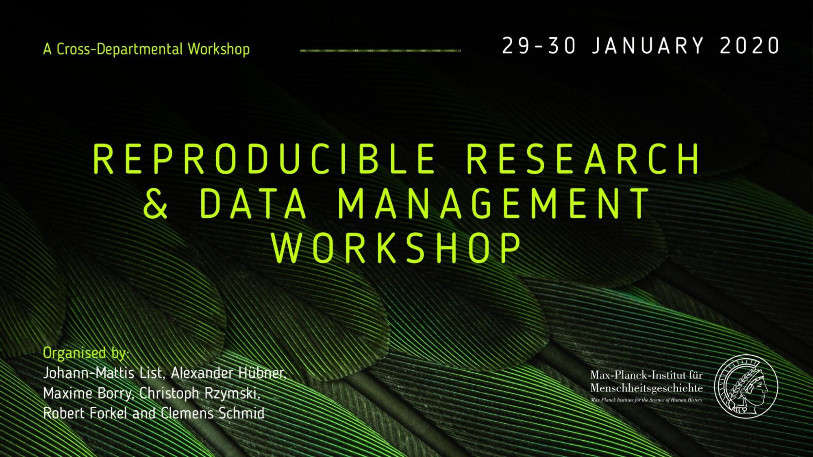
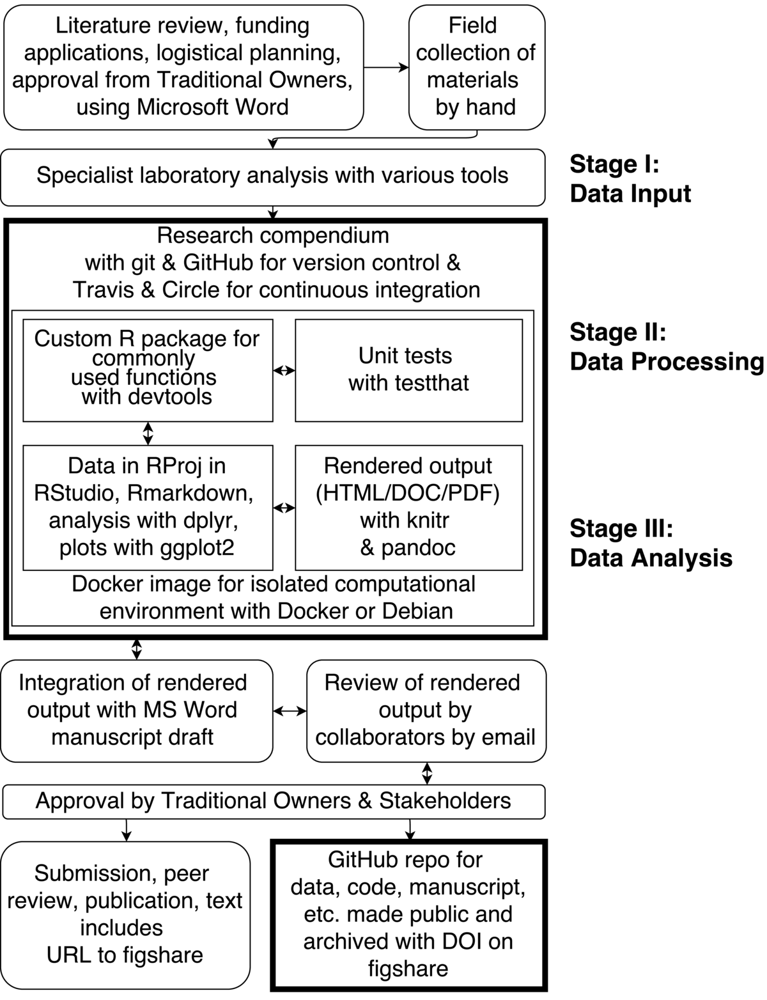

```{r setup, include=FALSE}
knitr::opts_chunk$set(eval = FALSE)

astro <- function() {
  fontawesome::fa("user-astronaut", fill = "#c7254e", height = 30)
}
rocket <- function() {
  fontawesome::fa("rocket", fill = "#c7254e", height = 30)
}
```

**url**



This tutorial was compiled by [Clemens Schmid]() for a [workshop on reproducible research and data management at MPI-SHH](https://rrdm-shh.github.io) in January 2020. It's based on and inspired by two workshops prepared by [Ben Marwick](http://faculty.washington.edu/bmarwick/) for the [SAA2019 conference](https://benmarwick.github.io/2019-04-10-saa/) and [Brown University Digital Archaeology Lab](https://benmarwick.github.io/2019-12-09-brown/).

# The Research Compendium

> A research compendium is a manuscript accompanied by code and data files (or persistent links to reputable online repositories) that allows reviewers and readers to reproduce and extend the results without needing any further materials from the original authors [...].
> 
> -- Marwick 2017, 442.

<div class="container">

<div>
A research compendium contains **relevant information** to make the **scientific process** behind a book, book chapter or journal article **more transparent** and **reproducible**.
</div>

<div>
Reproducible means **computational reproducibility** in this context: Other researchers should be able to run our code with our data to **obtain exactly the same statistical results and data visualizations**. Computational reproducibility is an important foundation of scientific reproducibility and progress.
</div>

<div>
A research compendium ideally contains **all** **data**, **code** and **text** necessary to compile the published document. This might be **difficult sometimes** due to raw data or text publishing **restrictions** or parts of the workflow that are **not quantitative** or inherently impossible to reproduce. The term research compendium therefore covers a whole **range of imaginable degrees of completeness**.
</div>

<div>
Research compendia can be compiled in many different ways. I will present **one particular workflow** and the software involved. The following figure by [Ben Marwick](https://www.practicereproducibleresearch.org/case-studies/benmarwick.html) illustrates one implementation.
</div>
</div>




# R for Reproducible Research

R (https://www.r-project.org/) is a **scripting language** and a framework for statistical data analysis. The way it is used for data analysis fits well to the research compendium concept. 

1. It is supported by an advanced working environment: **RStudio** 
2. it allows for direct integration of code and text: **RMarkdown**
3. It offers an established data structure to manage code, data and text: the **R package**

## RStudio

RStudio (https://rstudio.com/products/rstudio/) is an integrated development environment (**IDE**) specifically designed for R. 

Usually we would [install R and RStudio](https://benmarwick.github.io/2019-04-10-saa/#r) at this point and if you want to use these tools on your computer you should do so. For the purpose of this tutorial we will use an RStudio Cloud session, which allows us to use RStudio in a browser window. You can log in with your Github account: https://rstudio.cloud/project/848043

`r astro()``r rocket()`

If you never worked with R, you can use [swirl](https://swirlstats.com/students.html) to learn the basics.

## R Markdown

https://github.com/adam-p/markdown-here/wiki/Markdown-Cheatsheet

Markdown is a lightweight and easy-to-use markup language for styling your writing. It includes a limited set of conventions:

```
Syntax highlighted code block like the one you see here. This page is written with markdown.

# Header 1
## Header 2
### Header 3

- Bulleted
- List

1. Numbered
2. List

**Bold** and _Italic_ and `Code` text

[Link](url) and 
```

Text production with Markdown and R

`r astro()``r rocket()`

## Package structure

http://r-pkgs.had.co.nz/

```
mypackage/
|
├── DESCRIPTION         # Package Metadata file
├── R/                  # R code (files with functions)
├── man/                # Object (mostly functions) documentation
├── NAMESPACE/
|
├── vignettes/
├── data/
|
├── tests/
├── src/
├── inst/
|
└─ .Rbuildignore/
```

# rrtools

Definition

## Create an R package

```{r}
rrtools::use_compendium("pkgname")
```

## Activate version control

```{r}
usethis::use_git_config(user.name = "Jane Doe", user.email = "jane@example.com")
usethis::use_git()
usethis::browse_github_pat()
usethis::edit_r_environ()
usethis::use_github(protocol = "https", private = FALSE)
```

## Establish the compendium file structure

```{r}
rrtools::use_analysis()
```

## Start writing

Starting to write some text with RMarkdown

# Advanced topics

## Long-term data storage

## README, Code of Conduct and Contribution

```{r}
rrtools::use_readme_rmd()
```

## Licensing

```{r}
usethis::use_mit_license(name = "My Name")
```

## Virtualisation

```{r}
rrtools::use_dockerfile()
```

## CI/CD

```{r}
rrtools::use_travis(docker = FALSE)
```

## Unit tests

```{r}
usethis::use_testthat()
```

# Further reading

<p>Eglen, S. J., Marwick, B., Halchenko, Y. O., Hanke, M., Sufi, S., Gleeson, P., &hellip; &amp; Wachtler, T. (2017). Toward standard practices for sharing computer code and programs in neuroscience. <em>Nature Neuroscience</em> 20(6), 770-773. [<a href="http://doi.org/10.1038/nn.4550" target="_blank">DOI</a>] [<a href="https://doi.org/10.1101/045104" target="_blank">preprint</a>] [<a href="http://faculty.washington.edu/bmarwick/PDFs/Eglen_Marwick_et_al_2017_sharing_code.pdf" target="_blank">PDF</a>]</p>

<p>Marwick, B. 2017 Computational reproducibility in archaeological research: Basic principles and a case study of their implementation. <em>Journal of Archaeological Method and Theory</em> 24(2), 424-450. [<a href="http://doi.org/10.1007/s10816-015-9272-9" target="_blank">DOI</a>] [<a href="https://osf.io/preprints/socarxiv/q4v73" target="_blank">preprint</a>] <a href="https://doi.org/10.6084/m9.figshare.1563661" target="_blank">[code &amp; data]</a></p>

<p>Marwick 2017 Using R and Related Tools for Reproducible Research in Archaeology. In Kitzes, J., Turek, D., &amp; Deniz, F. (Eds.) <em>The Practice of Reproducible Research: Case Studies and Lessons from the Data-Intensive Sciences.</em> Oakland, CA: University of California Press. [<a href="https://www.practicereproducibleresearch.org/case-studies/benmarwick.html" target="_blank">online</a>]</p>

<p>Marwick, B., &amp; Birch, S. 2018 A Standard for the Scholarly Citation of Archaeological Data as an Incentive to Data Sharing. <em>Advances in Archaeological Practice</em> 1-19. [<a href="https://doi.org/10.1017/aap.2018.3" target="_blank">DOI</a>] [<a href="https://osf.io/preprints/socarxiv/py4hz/" target="_blank">preprint</a>] [<a href="http://faculty.washington.edu/bmarwick/PDFs/Marwick-and-Pilaar-Birch-2018-Data-Citation-AAP.pdf" target="_blank">PDF</a>] [<a href="https://doi.org/10.17605/OSF.IO/KSRUZ" target="_blank">code &amp; data</a>]</p>

<p>Marwick, B., Boettiger, C., &amp; Mullen, L. 2017 Packaging data analytical work reproducibly using R (and friends). <em>The American Statistician</em>  [<a href="https://doi.org/10.1080/00031305.2017.1375986" target="_blank">DOI</a>] [<a href="https://doi.org/10.7287/peerj.preprints.3192v1" target="_blank">preprint</a>]</p>

<p>Marwick, B, d’Alpoim Guedes, J., Barton, C. M., Bates, L. A., Baxter, M., Bevan, A., Bollwerk, E. A., Bocinsky, R. K., Brughmans, T., Carter, A. K., Conrad, C., Contreras, D. A., Costa, S., Crema, E. R., Daggett, A., Davies, B., Drake, B. L., Dye, T. S., France, P., Fullagar, R., Giusti, D., Graham, S., Harris, M. D., Hawks, J., Health, S., Huffer, D., Kansa, E. C., Kansa, S. W., Madsen, M. E., Melcher, J., Negre, J., Neiman, F. D., Opitz, R., Orton, D. C., Przstupa, P., Raviele, M., Riel-Savatore, J., Riris, P., Romanowska, I., Smith, J., Strupler, N., Ullah, I. I., Van Vlack, H. G., VanValkenburgh, N., Watrall, E. C., Webster, C., Wells, J., Winters, J., and Wren, C. D. (2017) Open science in archaeology. <em>SAA Archaeological Record</em>, 17(4), pp. 8-14. [<a href="http://bit.ly/2D7iN7n" target="_blank">PDF</a>] [<a href="https://osf.io/preprints/socarxiv/72n8g/" target="_blank">preprint</a>]</p>

<p>Ram, K. B. Marwick 2017 Building Towards a Future Where Reproducible, Open Science is the Norm. In Kitzes, J., Turek, D., &amp; Deniz, F. (Eds.) <em>The Practice of Reproducible Research: Case Studies and Lessons from the Data-Intensive Sciences.</em> Oakland, CA: University of California Press. [<a href="https://www.practicereproducibleresearch.org/core-chapters/6-future.html" target="_blank">online</a>]</p>

<p>Rokem, A., B. Marwick, V. Staneva 2017 Assessing Reproducibility. In Kitzes, J., Turek, D., &amp; Deniz, F. (Eds.) <em>The Practice of Reproducible Research: Case Studies and Lessons from the Data-Intensive Sciences.</em> Oakland, CA: University of California Press. University of California Press. [<a href="https://www.practicereproducibleresearch.org/core-chapters/2-assessment.html" target="_blank">online</a>]</p>

